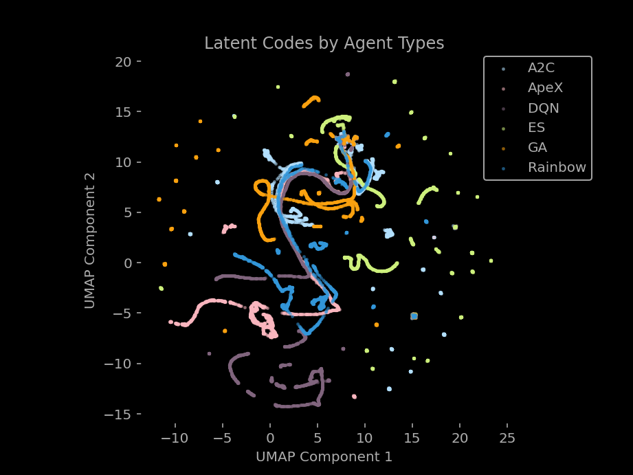
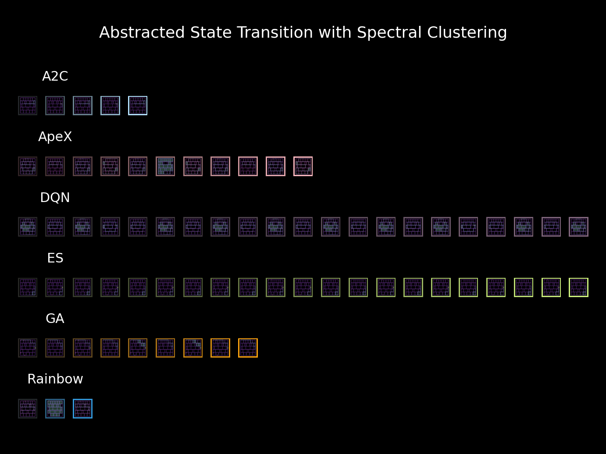

# Disentangling Dynamic World in the Mirror for Intuitive Explainability in Deep RL

 

Latent Space Trajectories of 20 Applications Colored by Different RL Agents

 

## 1. About the Project

In creating an intuitive explainable artificial intelligence (XAI) in reinforcement learning (RL), it is particularly of interest to investigate the difference between the concept space constructed by machine learning models and the concept space perceived by humans. In this project, I aim to explore the potential of applying disentangled variational autoencoders (Disentangled VAE) to various reinforcement learning applications and visualizing their latent spaces to explore the possibility of effectively abstracting the trajectories generated by RL agents. To abstract the trajectories, three different clustering algorithms were tested and the minimum expression of cluster transition for each clustering method were visualized. For actual implementation, see [demo code](./demo.ipynb). And all list of result is stored [here](./saved_images/).

## 2. What's Disentangled VAE and Why?

Disentanglement is one of the usefulness measures of a representation learned on data called _meta-prior_ studied in representation learning [1]. Assuming that the data is generated from independent factors of variation, for example object orientation and lighting conditions in images of objects, disentanglement as a meta-prior encourages these factors to be captured by different independent variables in the representation. It should result in a concise abstract representation of the data useful for a variety of downstream tasks and promises improved sample efficiency. Other measures of meta-prior assumed in VAE includes hierarchical representation, semi-supervised learning, and clustering [2].

The disentangled VAE has been widely used in previous studies in the field of state representation learning. The state representation learning aims to find low-dimensional states from high-dimensional raw sensory data so that the low-dimensional states can be used for the objective function of control problem [3]. This includes information processing such as reading the 3D position of objects from high-dimensional camera images in manipulation tasks of robot arms. In previous studied of state representation learning using the disentangled VAE, various advantages such as extension to multimodal observations for control problems and utilization in transfer learning have been pointed out. However, an approach from the perspective of improving the explainability of the black box agent model for users has been less explored.

## 3. Disentangled VAE

For learning disentangled representations, representative methods are based on either combining GANs with VAEs, re-weighting parts of a loss function, or assigning individual loss functions for encoder and decoder respectively. In this project, I will investigate the re-weighting technique that can be applied to the vanilla VAE with a little modification and ensure robustness in training. This technique is based on the hypothesis that more interpretable latent space can be acquired by applying various constraints to the mutual information term in the loss function of VAE [4]. Here, I will apply three models: VAE with Augmented KLD, $\beta$-VAE with controlled capacity, and $\beta$-TCVAE which are representative derivatives of the β-VAE, to 22 Atari games and investigate its disentangled representations in each model's latent space.

### 3.1 Model Architecture

The network architecture used in this project is from the work of [WorldModels](https://worldmodels.github.io/) that is one of representative studies in state representation learning.

### 3.2 Loss Functions

This section explains the loss function of vanilla VAE and variants of the loss function used in this project will be explained in the following subsections.

The loss function of vanilla VAE is as follows:

$$\mathbb{E_{\hat p(x)}}[-log p_{\theta}(x)]=\mathcal{L}_{VAE}(\theta, \phi) - \mathbb{E_{\hat p(x)}}[ D_{\mathbb{KL}}(q_{\phi}(z|x)||p_{\theta}(z|x)) ]$$

here, since the KL divergence in the second term is non-negative, - $\mathcal{L}_{VAE}(\theta, \phi)$, becomes the lower bound of log likelihood $\mathbb{E_{\hat p(x)}}[-log p_{\theta}(x)]$ (ELBO).
Thus, the following ELBO is maximized in training VAE.

$$\mathcal{L}_{VAE}(\theta, \phi)=\mathbb{E_{\hat p(x)}}[ \mathbb{E_{q_\phi(z|x)}}[-logp_\theta(x|z)]] - \mathbb{E_{\hat p(x)}}[ D_{\mathbb{KL}}(q_{\phi}(z|x)||p(z)) ]$$

The first term is trained by backpropagation from samples $ z^{(i)} \sim q*\phi(z|x^{(i)}) $ using reparametrization trick. The second term can be trained by either in closed-form that requires to set $q*\phi(z|x)=N(\mu*\phi(x), diag(\rho*\phi(x))$ and $p(z)=N(0,I)$, or evaluating a distance between distributions from samples. In this project, I used the closed-from, and following three different regulization term were added to the second term of the loss function to facilitate distanglement.

#### 3.2.1 Augmented KLD

The first variation is to set a lower limit value in the second term of ELBO [5]. This modification ensures always applying larger values than a constant value called tolerance to the ELBO in training.

$$\mathcal{L}_{VAE}(\theta, \phi)= \mathbb{E_{q_\phi(z|x)}}[-logp_\theta(x|z)] -  D_{\mathbb{KL}_{aug}}$$
$$D_{\mathbb{KL}_{aug}} = max(D_{\mathbb{KL}}(q_{\phi}(z|x)||p(z)), Tolerance)$$

#### 3.2.2 $\beta$-VAE with controlled capacity

The second modification is schedulig the regurilization parameter in the second term of ELBO by changing a parameter of capacity along with the number of training iterations [6]. Adjusting the scheduling is expected to improve the encoder's performance after improving the decoder's reconstruction loss which leads to more disentangled representation in latent space.

$$\mathcal{L}_{VAE}(\theta, \phi)= \mathbb{E_{q_\phi(z|x)}}[-logp_\theta(x|z)] -  \gamma |D_{\mathbb{KL}}(q_{\phi}(z|x)||p(z)) - Capacity|$$
$$ Capacity = max(C, Tolerance)$$

$$
C =\left\{
    \begin{array}{l}
    C_{max} & (iter \ge 1e5) \\
    \frac{C_{max}}{1e5} \times iter & (iter \lt 1e5)
    \end{array}
  \right.
$$

#### 3.3.3 $\beta$-TCVAE

In the last veriation, $\beta$-TCVAE, its loss function is expressed by the decomposition of the second term of ELBO. The components are mutual information(MI), total correlation (TC), and dimension-wise KL with parameters $\alpha$, $\beta$, and $\gamma$ respectively [4]. In this project, I used the parameters recommended in the referenced paper, $\alpha = \gamma = 1$ and $\beta=6$.
$$\mathcal{L}_{TC-VAE}(\theta, \phi)= \mathbb{E_{q_\phi(z|x)}}[-logp_\theta(x|z)] - \alpha I_q(z;x) - \beta D_{\mathbb{KL}}(q(z)||\prod_j q(z_j)) - \gamma \sum_j D_{\mathbb{KL}}(q(z_j)||p(z_j))$$

### 3.3 Hyperparameters and Tuning

Hyper parameters were tuned by observing the history of KLD loss and examining the quality of image reconstruction. The training was conducted with about 25,000 iterations.
 

### 3.4 Dataset and Preprocessing

Image dataset used in this project is from [Atari Zoo](https://github.com/uber-research/atari-model-zoo), which is a image dataset of Atari games played by six ML models (A2c, ApeX, DQN, GA, ES, and Rainbow). The link of the video image is [here](https://uber-research.github.io/atari-model-zoo/video.html).

In the preprocess, the game score part of the image is cropped out.

 

|                           A2C                           |                           ApeX                           |                           DQN                           |                           ES                           |                           GA                           |                           Rainbow                           |
| :-----------------------------------------------------: | :------------------------------------------------------: | :-----------------------------------------------------: | :----------------------------------------------------: | :----------------------------------------------------: | :---------------------------------------------------------: |
|  |  |  |  |  |  |

## 4. Results

In this section, the results in the case of Amidar game is presented. The results include VAE image reconstraction , latent space visualization, and visualization of abstracted trajectories are showcased.

For other cases of results, see [here](./saved_images/)

### 4.1 Reconstructed Images

Reconstructed images generated by three different disentangled VAEs are as follows:

|                              Augmented KLD                               |                             Controlled capacity                              |                                 $\beta$-TCVAE                                  |
| :----------------------------------------------------------------------: | :--------------------------------------------------------------------------: | :----------------------------------------------------------------------------: |
|  |  |  |

### 4.2 Trajectories on the Latent Space

Latent codes with 32 dimention generated by three different disentangled VAEs are visualized by UMAP. The number of components used in UMAP was set to 2 and other parameters of UMAP class were set to default values. Among the three VAE algorithms, $\beta$-TCVAE failed to generate a disentangled representation.

For clustering, Spectral Clustering [7], Agglomerative Clustering [8], HDBSCAN [9] and ST-DBSCAN [10] were used. These clustering methods are considered suitable for clustering trajectory data. Only ST-DBSCAN deals with temporal relationship in the dataset. The 2 dimensional UMAP component was used for input data of the clustering methods. Clustering was applied separately to the trajectories generated by each agent. In other word, 6 clustering classes corresponding to 6 different types of agent were used in each latent space.
Clustering results of each method are showcased below the latent space visualization. Representative images of each cluster are visualized in the clustering results. These images were reconstructed from the decoder of VAEs using median value of latent code distribution of each cluster.  
 
 

  Augmented KLD

  
  
  
  
  
  
   
  &beta;-VAE with controlled capacity

  
  
  

   
  &beta;-TCVAE

  
  
  
  
  

### 4.3 Abstracted States Transition

12 cases of abstracted states transition, which is the combination of 3 different VAEs and 4 different clustering methods, are showcased. Each small image is the representative image of each cluster. The sequence of image is the minimal expression of the cluster transition.

The minimal expression of cluster transition is acquired by taking following steps:

Step 1. Sort cluster label data for each agent by time frame

Step 2. Apply sliding window to the sorted data

Step 3. Count the frequency of cluster label within the window

Step 4. Take the most frequent cluster label as representative cluster of the window

Step 5. Remove adjecent duplicate cluster label from the sequence of the representative cluster of the window, for example a sequence '11555778988' becomes '157898'.

  Augmented KLD

&emsp;

&emsp;
 
 

&beta;-VAE with controlled capacity

&emsp;

&emsp;
 
 
&beta;-TCVAE

&emsp;

&emsp;

## 5. Discussions

As a result of qualitative evaluation, while fine tuning of hyper parameter has not been conducted yet, the combinations of either Augmented KLD and ST-DBSCAN or $\beta$-VAE and ST-DBSCAN seem to be able to generate good abstracted trajectories.
Since the latent space was forcedly projected into 2D space, undersiable discontinuity occured in the trajectories. Clustering using higher dimensional UMAP component would generates more smooth transition of abstracted trajectories. For fine tuning of clustering parameter, monte calro method using some quantitative clustering quality metrics would be required. If the results of abstracted trajectories still do not improve, hierarchical Bayesian model may be applied to find a higher level of abstracted trajectories.

## References

[1] Bengio, Y., Courville, A., & Vincent, P. (2013). Representation learning: A review and new perspectives. IEEE transactions on pattern analysis and machine intelligence, 35(8), 1798-1828.

[2] Tschannen, M., Bachem, O., & Lucic, M. (2018). Recent advances in autoencoder-based representation learning. arXiv preprint arXiv:1812.05069.

[3] Lesort, T., Díaz-Rodríguez, N., Goudou, J. F., & Filliat, D. (2018). State representation learning for control: An overview. Neural Networks, 108, 379-392.

[4] Chen, R. T., Li, X., Grosse, R., & Duvenaud, D. Isolating sources of disentanglement in VAEs. In Proceedings of the 32nd International Conference on Neural Information Processing Systems (Vol. 2615, p. 2625).

[5] Ha, D., & Schmidhuber, J. (2018). Recurrent world models facilitate policy evolution. Advances in neural information processing systems, 31.

[6] Burgess, C. P., Higgins, I., Pal, A., Matthey, L., Watters, N., Desjardins, G., & Lerchner, A. (2018). Understanding disentangling in $\beta $-VAE. arXiv preprint arXiv:1804.03599.

[7] Murtagh, F., & Legendre, P. (2014). Ward’s hierarchical agglomerative clustering method: which algorithms implement Ward’s criterion?. Journal of classification, 31, 274-295.

[8] Von Luxburg, U. (2007). A tutorial on spectral clustering. Statistics and computing, 17, 395-416.

[9] McInnes, L., Healy, J., & Astels, S. (2017). hdbscan: Hierarchical density based clustering. J. Open Source Softw., 2(11), 205.

[10] Birant, D., & Kut, A. (2007). ST-DBSCAN: An algorithm for clustering spatial–temporal data. Data & knowledge engineering, 60(1), 208-221.

## Licence

Released under MIT License.
